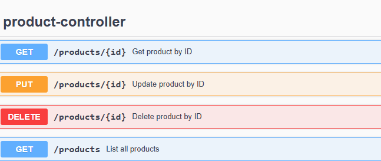
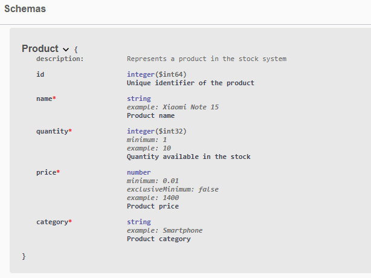
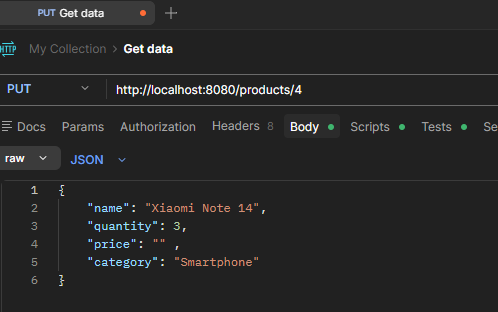
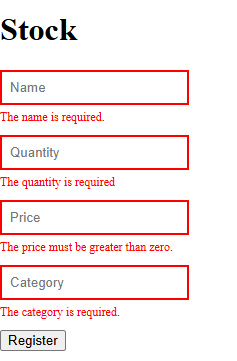

# 📦 Stock API

<p align="center">
  
  
  
  
  
  
</p>

---

---

## 📖 Sobre o Projeto

A **Stock API** é uma aplicação backend desenvolvida com **Java + Spring Boot** para gerenciamento de estoque através de uma API REST com operações completas de CRUD.

O projeto foi criado com foco em praticar conceitos reais de desenvolvimento backend, arquitetura em camadas, tratamento de erros e integração com banco de dados relacional.

Faz parte de um sistema completo com interface frontend em React — veja o link na seção abaixo.

---

## ✨ Funcionalidades

* ✅ Criar novos produtos
* ✅ Listar todos os produtos cadastrados
* ✅ Buscar produto por ID
* ✅ Atualizar produto existente
* ✅ Remover produto
* ✅ Validação de dados com Bean Validation
* ✅ Tratamento global de exceções com mensagens padronizadas
* ✅ Persistência com PostgreSQL
* ✅ Banco containerizado com Docker
* ✅ Documentação interativa com Swagger/OpenAPI

---

## 🛠️ Tecnologias Utilizadas

| Tecnologia      | Função                            |
| --------------- | --------------------------------- |
| Java 17         | Linguagem principal               |
| Spring Boot     | Framework backend                 |
| Spring Data JPA | Persistência de dados             |
| Hibernate       | ORM                               |
| PostgreSQL      | Banco de dados relacional         |
| Docker          | Containerização do banco          |
| Bean Validation | Validação de dados                |
| Swagger/OpenAPI | Documentação interativa da API    |
| Postman         | Testes de endpoints               |
| Maven           | Gerenciamento de dependências     |

---

## 📁 Estrutura do Projeto

```text
src/main/java/com/binotto/stock
│
├── config/          # Configuração do OpenAPI/Swagger
├── controller/      # Endpoints da API REST
├── exception/       # Tratamento global de exceções
├── model/           # Entidades JPA
├── repository/      # Camada de acesso a dados
├── service/         # Regras de negócio
│
└── StockApplication.java
```

---

## 🔗 Endpoints da API

| Método     | Endpoint           | Descrição                |
| ---------- | ------------------ | ------------------------ |
| `GET`      | `/products`        | Listar todos os produtos |
| `GET`      | `/products/{id}`   | Buscar produto por ID    |
| `POST`     | `/products`        | Criar produto            |
| `PUT`      | `/products/{id}`   | Atualizar produto        |
| `DELETE`   | `/products/{id}`   | Remover produto          |

---

## 📄 Documentação Swagger

A API conta com documentação interativa gerada automaticamente via **Swagger/OpenAPI**.

Após subir a aplicação, acesse:

```
http://localhost:8080/swagger-ui.html
```

### Visão geral dos endpoints



### Schema do produto

O schema exibe os tipos, validações e exemplos de cada campo diretamente na documentação.



---

## 🧪 Testes da API

Todos os endpoints são testados e validados utilizando **Postman** durante o desenvolvimento.



---

## ✅ Validações

As validações são aplicadas automaticamente via Bean Validation e retornam mensagens de erro padronizadas tanto na API quanto no frontend.



---

## 🗄️ Banco de Dados

Este projeto utiliza **PostgreSQL** como banco de dados relacional, executado em um **container Docker**.

---

## ▶️ Como Executar o Projeto

### 1. Clonar o Repositório

```bash
git clone https://github.com/pamella-binotto/Stock-Control.git
```

### 2. Subir Container PostgreSQL

```bash
docker run --name postgres-db \
-e POSTGRES_PASSWORD=sua_senha \
-p 5432:5432 \
-d postgres
```

### 3. Configurar Variáveis de Ambiente

Atualize o arquivo `application.yml` com suas credenciais locais do PostgreSQL.

### 4. Executar a Aplicação

```bash
./mvnw spring-boot:run
```

Ou execute diretamente pela IDE.

---

## 🌐 Frontend do Projeto

A interface frontend deste sistema foi desenvolvida em **React** e consome esta API.

➡️ **[Stock Control Frontend](https://github.com/pamella-binotto/Stock-Control-Frontend)**

---


## 👩‍💻 Autora

**Pamella Binotto**
Desenvolvedora Full Stack 🚀
